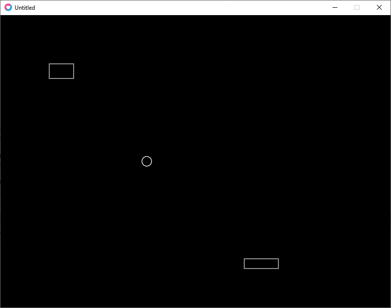

# Casse Brique avec Love2D et Lua 

---

> Librement adapté, voir par endroits carrément copié, du tutoriel en Anglais qui se trouve sur GitHub. J'ai décidé de suivre son approche minimale avec une montée en charge par l'ajout de fonctionnalité.
>
> Voila le lien d'origine :https://github.com/noooway/love2d_arkanoid_tutorial

## Table des matières

[TOC]

## Chapitre 1 - Les Bases

#### Une balle, une brique et une raquette.

Le casse brique le plus minimaliste qui soit représente des formes simples à l'écran. La balle par un rond, la brique et la raquette par deux rectangles. Mais ces objets simples ont néanmoins des propriétés qui permettent de définir leurs formes, leur tailles et leurs emplacement.

Définissons en premier lieu la balle :

```lua
local balle = {
	x		= 300,
	y		= 300,
    radius	= 10
}
```

Ensuite, définissons la raquette :

```lua
local raquette = {
	x		= 500,
	y		= 500,
	width	= 70,
	height	= 20
}
```

Et, enfin, LA brique. (Oui, ça casse pas des briques quand il n'y en a qu'une seule...)

```lua
local brique = {
	x		= 100,
	y		= 100,
	width	= 50,
	height	= 30
}
```

Tapons maintenant le code pour afficher tout ça :

```lua
function love.draw()
    love.graphics.circle("line", 
        balle.x, balle.y,
        balle.radius)
    love.graphics.rectangle("line", 
        raquette.x, raquette.y, 
        raquette.width, raquette.height)
    love.graphics.rectangle("line",
    	brique.x, brique.y,
    	brique.width, brique.height)
end
```

Voici le résultat : 

[01-01]: Code/Niveau1/CasseBrique01-01/main.lua "Code lua"



Comme vous le constatez, nous avons mis le code qui dessine tout dans la fonction `love.draw()`. Cette fonction est appelée en permanence par Love2d pour dessiner ce qui doit être présent à l'écran.

#### Il faut faire bouger tout ça !

Pour faire bouger les choses, il faut leur donner une vitesse. Reprenons les définitions précédentes :

La balle se déplace de haut en bas et de gauche à droite. Nous allons donc lui donner des paramètres de vitesse pour ces deux directions :

```lua
local balle = {
	x		= 300,
	y		= 300,
    radius	= 10,
    vx		= 300,	-- Vitesse en X (vitesse horizontale)
    vy		= 300	-- Vitesse en Y (vitesse verticale)
}
```

La raquette se déplace aussi, sur le plan horizontal uniquement, donc nous ne nous occuperont uniquement de cet axe de déplacement :

```lua
local raquette = {
	x		= 500,
	y		= 500,
	width	= 70,
	height	= 20,
	vx		= 300,	-- Vitesse en X (vitesse horizontale)
}
```

Et maintenant il est temps d'introduire quelques notions supplémentaires !

- La balle dois se déplacer sans interactions du joueur, si ce n'est lorsqu'elle sera en contact avec la raquette, mais ce n'est pas encore au programme.
- La raquette dois se déplacer vers la gauche quand le joueur appuie sur la touche "Flèche vers la gauche" et vers la droite quand le joueur appuie sur la touche "Flèche vers la droite".

Et ces comportements doivent être codés ! Nous devons donc mettre à jour la position de la balle et de la raquette en modifiant les valeurs de leurs X et Y. Dans le cas de la raquette, nous devons le faire uniquement si le joueur appuie sur certaines touches.

Pour les mises à jour, nous utiliseront la fonction `love.update(dt)`. Au passage, constatez que cette fonction viens avec un paramètre, `dt`. Ce paramètre est très important dans le fonctionnement des jeux, il permet la création de jeux qui auront la même vitesse apparente quelque soit la puissance de l'ordinateur qui exécute le code. `dt` est ce que l'on appelle un `deltaTime`, c'est à dire qu'il contient, en millisecondes, le temps qui s'est écoulé depuis le dernier appel à la fonction `love.update(dt)`. Mettons le en application de suite :

```lua
function love.update( dt )
   balle.x = balle.x + balle.vx * dt
   balle.y = balle.y + balle.vy * dt
end
```

Là, la balle va se déplacer indéfiniment vers la droite (on augmente la valeur de balle.x) et vers le bas (même chose pour balle.y).

Nous y ajoutons maintenant le code pour la raquette :

```lua
function love.update( dt )
   balle.x = balle.x + balle.vx * dt
   balle.y = balle.y + balle.vy * dt
   
   if love.keyboard.isDown("right") then
      raquette.x = raquette.x + (raquette.vx * dt)
   end
   
   if love.keyboard.isDown("left") then
      raquette.x = raquette.x - (raquette.vx * dt)
   end
end
```

Si vous exécutez ce code, vous constaterez que vous pouvez déplacer la raquette sur le plan horizontal en appuyant sur les touches gauche et droites de votre clavier. Quand à la balle, et va se déplacer et disparaître, mais continuera de se déplacer tant que vous n'aurez pas stoppé le programme. Même chose pour la raquette. Elle peux disparaître de l'écran.

[01-02]: Code/Niveau1/CasseBrique01-02/main.lua "Code lua"

#### Les tables sont aussi des objets !

Hé oui. Pour le moment nous avons des tables avec des paramètres, ou des champs plus précisément. Mais nous pouvons aussi attacher à une table des fonctions ! Reprenons donc le code de notre balle, de notre raquette et de notre brique.

Pour ce faire, nous allons attacher à la balle ses propres fonctions de mise à jour et de dessin.

```lua
local balle = {
	x		= 300,
	y		= 300,
    radius	= 10,
    vx		= 300,	-- Vitesse en X (vitesse horizontale)
    vy		= 300	-- Vitesse en Y (vitesse verticale)
}

balle.update = function(dt)		-- Nous récupérons le deltaTime
	balle.x = balle.x + balle.vx * dt
	balle.y = balle.y + balle.vy * dt
end

balle.draw = function()
	love.graphics.circle("line", 
        balle.x, balle.y,
        balle.radius)
end
```

Même chose pour la raquette :

```lua
local raquette = {
	x		= 500,
	y		= 500,
	width	= 70,
	height	= 20,
	vx		= 300,	-- Vitesse en X (vitesse horizontale)
}

raquette.update = function(dt)	-- Nous récupérons le deltaTime
   if love.keyboard.isDown("right") then
      raquette.x = raquette.x + (raquette.vx * dt)
   end
   
   if love.keyboard.isDown("left") then
      raquette.x = raquette.x - (raquette.vx * dt)
   end
end

raquette.draw = function()
	love.graphics.rectangle("line", 
        raquette.x, raquette.y, 
        raquette.width, raquette.height)
end
```

Puis, pour finir, la brique. Celle ci ne bougeant pas, il n'y a pas d'update spécifique :

```lua
local brique = {
	x		= 100,
	y		= 100,
	width	= 50,
	height	= 30
}

brique.draw = function()
	love.graphics.rectangle("line",
    	brique.x, brique.y,
    	brique.width, brique.height)
end
```

Enfin, le corps du programme :

```lua
function love.update(dt)
	balle.update(dt)	-- Nous fournissons le deltaTime
	raquette.update(dt)	-- au fonctions update des objets
end

function love.draw()
	balle.draw()		-- nous utilisons les fonctions draw
	raquette.draw()		-- des objets.
	brique.draw()
end
```

Et voilà. Nous avons exactement le même comportement qu'auparavant, mais nous avons préparé le chemin pour améliorer les choses, comme par exemple la multiplication des briques ! ;)

[01-03]: Code/Niveau1/CasseBrique01-03/main.lua "Code lua"

#### Ajoutons des briques

Pour ce faire, nous allons créer une nouvelle table qui va contenir les briques :

```lua
local briques = {
	width			= 50,
	height			= 30,
	niveau_courant	= {}
}
```

Puis une fonction qui permet de créer de nouvelles briques :

```lua
briques.new = function( _x, _y, _width, _height )
	return({
            x = _x, 
            y = _y,
            width = _width or briques.width,		-- si width ou height ne sont pas
	     	height = _height or briques.height 		-- renseigné; alors on prend les
        })											-- valeurs de briques.
end
```

Comme vous devriez le constater, cette fonction renvoi un objet sous la forme d'une table. Nous allons maintenant ajouter cet objet à la liste des brique du niveau courant :

```lua
briques.add = function( brique )
	table.insert( briques.niveau_courant, brique )
end
```

Puis créer la fonction qui affichera une brique à l'écran :

```lua
briques.drawBrique = function( brique )
   love.graphics.rectangle( 'line',
			    brique.x,
			    brique.y,
			    brique.width,
			    brique.height 
    	)
end
```

Enfin, la fonction qui les affichera toutes :

```lua
briques.draw = function()
	for _, brique in pairs( briques.niveau_courant) do
		briques.drawBrique( brique )
	end
end
```

Petite explication concernant le caractère '_' utilisé ci dessus. Nous utilisons ce caractère quand une variable est inutile dans le code.

Vous constaterez que l'objet brique et ses fonctions ont disparus et remplacés par briques et ses fonctions. Il est temps maintenant de se servir de ces nouvelles fonctions, pour se faire, nous allons nous servir d'une fonction de love2d : `love.load()`, qui à la particularité de n'être appelée qu'une seule fois au lancement du jeu :

```lua
function love.load()   
    briques.add(briques.new( 100, 100 ))
    briques.add(briques.new( 220, 100 ))
    briques.add(briques.new( 280, 145 ))
    briques.add(briques.new( 340, 145 ))
end
```

Puis nous modifions légèrement la fonction `love.draw()` :

```lua
function love.draw()
	balle.draw()
	raquette.draw()
	briques.draw()	- Nous remplaçons brique.draw() par briques.draw()
end
```
Voilà le résultat :

[01-04]: Code/Niveau1/CasseBrique01-04/main.lua "Code lua"


#### Des briques et des murs

Bon, nous avons déjà pas mal de petits trucs et de machins qui vont nous permettre d'aller plus loin. Maintenant c'est au tour des murs et, surtout, de la multiplication des petits parpaings...Heuu.. Briques.

Nous allons donc commencer à, encore une fois, modifier le code existant. En occurrence, le code de l'objet `briques` :

```lua
local briques = {
	lignes			= 8,		-- 8 lignes de briques
	colonnes		= 11,		-- 11 colonnes de briques
	origineX		= 70,		-- position de départ en X
	origineY		= 50,		-- position de départ en Y
	decalageX		= 10,		-- distance entre les briques en X
	decalageY		= 10,		-- distance entre les briques en Y
	width			= 50,
	height			= 30,
	niveau_courant	= {}
}
```

Puis nous créons la fonction qui va créé les briques en fonction de ce qui aura été défini ci-dessus :

```lua
briques.preparerNiveau = function()
	for ligne = 1, briques.lignes do
		for colonne = 1, briques.colonnes do
			local brique = {}
			brique.x =	briques.origineX +
						( colonne - 1 ) *
						( briques.width + briques.decalageX )
			brique.y = briques.origineY +
						( ligne - 1 ) *
						( briques.height + briques.decalageY )
			brique.width = briques.width
			brique.height = briques.height
			briques.add( brique )
		end      
	end   
end
```

Finalement, nous modifions le `love.load()` :

```lua
function love.load()   
	briques.preparerNiveau()
end
```

Au lancement, ça donne ceci :

[01-05]: Code/Niveau1/CasseBrique01-05/main.lua "Code lua"


#### Oui, oui, les murs aussi !

Voilà le code pour les murs, rien de neuf :

```lua
local murs = {
    epaisseur		= 20,
    niveau_courant	= {}
}
```

On y ajoute les fonctions pour créer un nouveau mur, pour l'ajouter au niveau et pour l'afficher. Voici tout en vrac, vu que vous maîtrisez déjà tout le processus ! ;) Sauf....sauf la fonction qui permet de créer tout les murs, parce qu'il y a de nouvelles choses à l'intérieur du dedans du truc...

```lua
murs.new = function( _x, _y, _width, _height )
	return({
		x		= _x,
		y		= _y,
		width	= _width,
		height	= _height
	})
end

murs.drawMur = function( mur )
	love.graphics.rectangle( 'line',
			    mur.x,
			    mur.y,
			    mur.width,
			    mur.height 
	)
end
```

Puis la fonction de préparation des murs 

```lua
murs.preparerMurs = function()
	murs.niveau_courant["left"] = murs.new(
								0, 0, 
								murs.epaisseur, love.graphics.getHeight()
							)
							
	murs.niveau_courant["right"] = murs.new(
								love.graphics.getWidth() - murs.epaisseur, 0,
								murs.epaisseur, love.graphics.getHeight()
							)
							
	murs.niveau_courant["top"] = murs.new(
								0, 0, 
								love.graphics.getWidth(), murs.epaisseur
							)
							
	-- On va aussi en mettre un en bas, nous l'enlèverons plus tard
	murs.niveau_courant["bottom"] = murs.new(
								0, love.graphics.getHeight() - murs.epaisseur, 
								love.graphics.getWidth(), murs.epaisseur
							)
end
```

Vous constaterez que cette fois ci nous avons "nommé" les index des murs, nous ne nous sommes pas contentés d'utiliser la fonction `table.insert()`. De plus nous avons utilisé les fonctions `love.graphics.getWidth()` et `love.graphics.getHeight()` qui nous renvoient respectivement la largeur et la hauteur de la fenêtre. Où plus précisément de la zone de la fenêtre dans laquelle nous affichons nos objets.

Que nous afficherons à l'aide de la fonction suivante :

```lua
murs.draw = function()
	for _, mur in pairs( murs.niveau_courant ) do
		murs.drawMur( mur )
	end
end
```

Plus qu'a ajouter les appels de fonction dans `love.draw()` :

```lua
function love.draw()
	balle.draw()		-- nous utilisons les fonctions draw
	raquette.draw()		-- des objets.
	briques.draw()
	murs.draw()
end
```

Voilà à quoi ça ressemble  : 

[01-06]: Code/Niveau1/CasseBrique01-06/main.lua "Code lua"


#### C'est bien beau tout ça, mais la baballe, elle va continuer à se sauver ?

Ben, pourquoi pas ? Bon, ok, c'est pas drôle... Nous allons maintenant nous engager dans une partie du code qui va nous permettre de gérer les **Collisions** !

Mais quoi qu'est-ce que ça ? Hé bien nous sommes en train de coder, donc nous pouvons dire que nous sommes dans un univers virtuel où seuls les chiffres comptent, les corps n'ont pas de substance, mais des positions et des dimensions. Il va nous falloir faire des calculs pour déterminer s'il y a une collision entre les objets. Si la balle touche la raquette, ou une brique ou un mur. Si la raquette touche un mur. Tout se calcule avec les éléments dont nous disposons déjà, par contre il va falloir définir le comportement de tout ça.

En premier lieu, nous allons définir les fonction pour calculer les collisions. Juste ça, rien de plus. Nous définirons les comportements plus tard.

Pour nous faciliter la lecture du code, nous allons mettre les fonctions dans une table.

```lua
-- Collisions
local collisions = {}
```

La fonction de détection de collision de rectangle est celle-ci :

```lua
collisions.CollisionRectangles = function( rectangle1, rectangle2 )
   local collision = false
   if not (	rectangle1.x + rectangle1.width < rectangle2.x or
			rectangle2.x + rectangle2.width < rectangle1.x or
			rectangle1.y + rectangle1.height < rectangle2.y or 
			rectangle2.y + rectangle2.height < rectangle1.y ) then
      collision = true
   end
   return collision
end
```

Maintenant, nous allons calculer s'il y a collision avec la raquette :

```lua
collisions.balle_Raquette = function( balle, raquette )
	local rectangle1 = {
		x		= raquette.x,
		y		= raquette.y,
		width	= raquette.width,
		height	= raquette.height 
    }
   local rectangle2 = {
		x		= balle.x - balle.radius,
		y		= balle.y - balle.radius,
		width	= 2 * balle.radius,
		height	= 2 * balle.radius 
    }
	if collisions.CollisionRectangles( rectangle1, rectangle2 ) then
		print( "Collision balle-raquette" )
	end      
end
```

Puis le calcul de collision de la balle avec les murs :

```lua
collisions.balle_murs = function( balle, murs )
   local rectangle2 = {
		x		= balle.x - balle.radius,
		y		= balle.y - balle.radius,
		width	= 2 * balle.radius,
		height	= 2 * balle.radius 
    }
	
	for _, mur in pairs( murs.niveau_courant ) do
		local rectangle1 = {
			x		= mur.x,
			y		= mur.y,
			width	= mur.width,
			height	= mur.height 
		}
		if collisions.CollisionRectangles( rectangle1, rectangle2 ) then
			print( "Collision balle-mur" )
		end
	end
end
```

Et le calcul de collision de la balle avec les briques :

```lua
collisions.balle_briques = function( balle, briques )
   local rectangle2 = {
		x		= balle.x - balle.radius,
		y		= balle.y - balle.radius,
		width	= 2 * balle.radius,
		height	= 2 * balle.radius 
    }
	
	for _, brique in pairs( briques.niveau_courant ) do
		local rectangle1 = {
			x		= brique.x,
			y		= brique.y,
			width	= brique.width,
			height	= brique.height 
		}
		if collisions.CollisionRectangles( rectangle1, rectangle2 ) then
			print( "Collision balle-brique" )
		end
	end
end
```

Et pour finir, le calcul de collision de la raquette avec les murs :

```lua
collisions.raquette_murs = function( raquette, murs )
	for _, mur in pairs( murs.niveau_courant ) do
		local rectangle1 = {
			x		= mur.x,
			y		= mur.y,
			width	= mur.width,
			height	= mur.height 
		}
		if collisions.CollisionRectangles( rectangle1, raquette ) then
			print( "Collision raquette-mur" )
		end
	end
end
```

Nous allons maintenant ajouter une fonction qui va appeler toutes celles que nous avons créé :

```lua
collisions.tester_collisions = function()
	collisions.balle_Raquette( balle, raquette )
	collisions.balle_murs( balle, murs )
	collisions.balle_briques( balle, briques )
	collisions.raquette_murs( raquette, murs )
end
```

Puis l'appeler dans `love.update(dt)` :

```lua
function love.update(dt)
	balle.update(dt)	-- Nous fournissons le deltaTime
	raquette.update(dt)	-- au fonctions update des objets
	collisions.tester_collisions()
end
```

A l'écran, rien de directement visible, mais dans la console, par contre, vous pourrez voir quelque chose comme ceci (il y a normalement un grand nombre de lignes, a 60 images secondes, c'est normal, les fonction étant exécutées 60 fois chaque seconde) :

[01-07]: Code/Niveau1/CasseBrique01-07/main.lua "Code lua"

```terminal
Collision balle-brique
Collision balle-brique
Collision balle-brique
Collision balle-brique
Collision balle-brique
Collision balle-mur
Collision raquette-mur
Collision balle-mur
Collision raquette-mur
Collision balle-mur
Collision raquette-mur
Collision raquette-mur
Collision raquette-mur
Collision raquette-mur
Collision raquette-mur
Collision raquette-mur
```

#### Bon, ok, super, mais maintenant j'aimerais bien la voir rebondir, cette balle !

Oui, oui, nous nous en occupons tout de suite Môssieurdame, immédiatement, Môssieurdame !

Bon, nous savons donc que la balle, quand elle touche quelque chose, rebondis. Sisi, nous le savons ! C'est écris en dur dans les 2575 commandements des déplacements de balles dans des univers mathématiques ! (Croix de bois, croix de fer, si je ment je mange des broccolis).

Vu la pression que me met le/la Môssieurdame, je vous livre le code qui permet de modifier le comportement de la baballe. Et comme je suis fâché, je vous ajoute une nouvelle fonction, tiens. ça vous fera des chevilles ! Non mais...

```lua
balle.rebondis = function( decalageX, decalageY )
	local decalage_minimum = math.min(		-- nous déterminons quelle est la valeur
				math.abs( decalageX ),		-- la plus petite entre decalageX et decalageY
				math.abs( decalageY )		-- Pour déterminer si la collision la plus
			)								-- proche est verticale ou horizontale
			   
	if math.abs( decalageX ) == decalage_minimum then	-- Si la plus petite est decalageX
		decalageY = 0									-- alors decalageY = 0
	else
		decalageX = 0									-- Sinon decalageX = 0
	end
	
	balle.x = balle.x + decalageX		-- on ajoute decalageX à balle.x
	balle.y = balle.y + decalageY		-- on ajoute decalageY à balle.y
   
	if decalageX ~= 0 then
		balle.vx = -balle.vx	-- Si decalageX différent de 0 alors on inverse balle.vx
	end
	if decalageY ~= 0 then
		balle.vy  = -balle.vy	-- Si decalageY différent de 0 alors on inverse balle.vy
	end
end							-- Le résultat des invertions est de donner l'effet rebond.
```

Petite explication :

- `math.min(arg1, arg2, arg3, ...)` renvoi la valeur la plus petite parmi les arguments.
- `math.abs(argument)` renvoi la valeur absolue de l'argument. Comprenez que -1 ou 1 = 1.
- Et pour le reste, creusez vous un peu la tête pour comprendre ! :D
- Un indice : Lisez les commentaires... :p

Nous allons maintenant transformer la fonction de détection de collisions de rectangles, `CollisionRectangles( rectangle1, rectangle2 )` pour pouvoir renvoyer non seulement s'il y a eu collision, mais également un décalage en X et en Y pour définir une direction.

```lua
collisions.CollisionRectangles = function( rectangle1, rectangle2 )
	local collision = false
	local decalageX, decalageY = 0, 0
	if not (	rectangle1.x + rectangle1.width < rectangle2.x or
			rectangle2.x + rectangle2.width < rectangle1.x or
			rectangle1.y + rectangle1.height < rectangle2.y or 
			rectangle2.y + rectangle2.height < rectangle1.y ) then
		collision = true

		if ( rectangle1.x + rectangle1.width / 2 ) < 
           ( rectangle2.x + rectangle2.width / 2 ) then
			decalageX = ( rectangle1.x + rectangle1.width ) - rectangle2.x
		else 
			decalageX = rectangle1.x - ( rectangle2.x + rectangle2.width )
		end
		if ( rectangle1.y + rectangle1.height / 2 ) < 
           ( rectangle2.y + rectangle2.height / 2 ) then
			decalageY = ( rectangle1.y + rectangle1.height ) - rectangle2.y
		else
			decalageY = rectangle1.y - ( rectangle2.y + rectangle2.height )      
		end      
	end
	return collision, decalageX, decalageY
end
```

Bon, il va quand même falloir que je vous explique un peu... 

Après avoir initialisé les décalages à 0, on teste s'il y a une collision.

Si collision, alors on teste si le centre du rectangle 1 est à gauche du rectangle 2. Si oui, alors le décalage en X sera égal à la distance entre le côté gauche du rectangle 2 et le centre du rectangle 1. Si non, alors le décalage en X sera égal à la distance entre le côté gauche du rectangle 1 et le centre du rectangle 2.

C'est le même principe pour l'axe des Y sauf que dans ce cas, ce sera le côté haut puis le côté bas.

Tous ses tests permettent non seulement de tester s'il y a collision, mais aussi avec quel côté.

Il faut également modifier les différentes fonctions de calculs de collisions pour pendre en compte les nouvelles données de décalage . Il y a peu de modifications, mais je vais tout de même vous mettre ici l'intégralité des fonctions modifiées :

```lua
collisions.balle_Raquette = function( balle, raquette )
	local rectangle1 = {
		x		= raquette.x,
		y		= raquette.y,
		width	= raquette.width,
		height	= raquette.height 
    }
   local rectangle2 = {
		x		= balle.x - balle.radius,
		y		= balle.y - balle.radius,
		width	= 2 * balle.radius,
		height	= 2 * balle.radius 
    }
--	les modifications à partir d'ici
	local collision, decalageX, decalageY = 
    		collisions.CollisionRectangles( rectangle1, rectangle2 )
	if collision then
		balle.rebondis( decalageX, decalageY )
	end      
end

collisions.balle_murs = function( balle, murs )
   local rectangle2 = {
		x		= balle.x - balle.radius,
		y		= balle.y - balle.radius,
		width	= 2 * balle.radius,
		height	= 2 * balle.radius 
    }
	
	for _, mur in pairs( murs.niveau_courant ) do
		local rectangle1 = {
			x		= mur.x,
			y		= mur.y,
			width	= mur.width,
			height	= mur.height 
		}
--	les modifications à partir d'ici
		local collision, decalageX, decalageY = 
				collisions.CollisionRectangles( rectangle1, rectangle2 )
		if collision then
			balle.rebondis( decalageX, decalageY )
		end      
	end
end

collisions.balle_briques = function( balle, briques )
   local rectangle2 = {
		x		= balle.x - balle.radius,
		y		= balle.y - balle.radius,
		width	= 2 * balle.radius,
		height	= 2 * balle.radius 
    }
	
	for _, brique in pairs( briques.niveau_courant ) do
		local rectangle1 = {
			x		= brique.x,
			y		= brique.y,
			width	= brique.width,
			height	= brique.height 
		}
--	les modifications à partir d'ici
		local collision, decalageX, decalageY = 
				collisions.CollisionRectangles( rectangle1, rectangle2 )
		if collision then
			balle.rebondis( decalageX, decalageY )
		end      
	end
end
```

Concernant la raquette, nous voulons aussi qu'elle soit stoppée par les murs, non ? Alors voici le code en cas de collision avec un mur (A placer, par exemple, sous la définition de la fonction `raquette.update`) :

```lua
raquette.rebondis = function ( decalageX )
	raquette.x = raquette.x + decalageX
end
```

Puis dans les collisions, on modifie `collisions.raquette_murs()` :

```lua
collisions.raquette_murs = function( raquette, murs )
	for _, mur in pairs( murs.niveau_courant ) do
		local rectangle1 = {
			x		= mur.x,
			y		= mur.y,
			width	= mur.width,
			height	= mur.height 
		}

		local collision, decalageX = 
				collisions.CollisionRectangles( rectangle1, raquette )
	  
 		if collision then
			raquette.rebondis( decalageX)
		end      
	end
end
```

Il est temps maintenant de faire disparaître les briques lorsqu'elles sont touchées !

Voilà le petit code nécessaire, a placer dans la zone de définition des briques :

```lua
briques.touchee = function( index )
   table.remove( briques.niveau_courant, index )
end
```

Puis de l'appeler dans la fonction `collisions.balle_briques`

```lua
collisions.balle_briques = function( balle, briques )
   local rectangle2 = {
		x		= balle.x - balle.radius,
		y		= balle.y - balle.radius,
		width	= 2 * balle.radius,
		height	= 2 * balle.radius 
    }
-- remarquez que l'on à mis index à la place de _ car cette fois ci on en a besoin
	for index, brique in pairs( briques.niveau_courant ) do
		local rectangle1 = {
			x		= brique.x,
			y		= brique.y,
			width	= brique.width,
			height	= brique.height 
		}
		local collision, decalageX, decalageY = 
				collisions.CollisionRectangles( rectangle1, rectangle2 )
		if collision then
			balle.rebondis( decalageX, decalageY )
			briques.touchee( index )
		end      
	end
end
```


Voilà le résultat :


[01-08]: Code/Niveau1/CasseBrique01-08/main.lua "Code lua"


#### Bien, mais on ne pourrais pas avoir plusieurs niveaux ?

Sisi, on y arrive !

Nous avons préparé les briques, la balle, la raquette, les murs puis les collisions, maintenant au tour des niveaux.

Il va falloir bien sûr modifier quelque peu les fonctions déjà existantes pour gérer les niveaux, mais rien de grave.

En premier lieu, créons la table des niveaux et définissons quelques trucs et machins :

```lua
local niveaux = {
	niveauCourant	= 1,
	jeuFini			= false
	liste 			= {
		[1] = {
				{ 0, 0, 0, 0, 0, 0, 0, 0, 0, 0, 0 },
				{ 0, 0, 0, 0, 0, 0, 0, 0, 0, 0, 0 },
				{ 1, 0, 1, 0, 1, 1, 1, 0, 1, 0, 1 },
				{ 1, 0, 1, 0, 1, 0, 0, 0, 1, 0, 1 },
				{ 1, 1, 1, 0, 1, 1, 0, 0, 0, 1, 0 },
				{ 1, 0, 1, 0, 1, 0, 0, 0, 0, 1, 0 },
				{ 1, 0, 1, 0, 1, 1, 1, 0, 0, 1, 0 },
				{ 0, 0, 0, 0, 0, 0, 0, 0, 0, 0, 0 },
		},
		[2] = {
				{ 0, 0, 0, 0, 0, 0, 0, 0, 0, 0, 0 },
				{ 0, 0, 0, 0, 0, 0, 0, 0, 0, 0, 0 },
				{ 1, 1, 0, 0, 1, 0, 1, 0, 1, 1, 1 },
				{ 1, 0, 1, 0, 1, 0, 1, 0, 1, 0, 0 },
				{ 1, 1, 1, 0, 0, 1, 0, 0, 1, 1, 0 },
				{ 1, 0, 1, 0, 0, 1, 0, 0, 1, 0, 0 },
				{ 1, 1, 1, 0, 0, 1, 0, 0, 1, 1, 1 },
				{ 0, 0, 0, 0, 0, 0, 0, 0, 0, 0, 0 },
		}
	}
}
```

Et oui, vous avez bien vu. Nous avons 2 niveaux préparés dans cette table ! Ce n'est pas la meilleure façon de faire. L'idéal serait d'avoir des niveaux dans un fichier spécial que l'on charge au démarrage, est qui est facilement modifiable pour ajouter de nouveaux niveaux. Mais pour le moment nous nous contenterons de ceci !

Ces niveaux sont constitués de lignes et de colonnes contenant des 0 et des 1. Comme vous l'aurez deviné, les 1 sont des briques, les 0 représentent un espace vide.

Il nous faut maintenant maintenant une fonction pour pouvoir changer de niveau :

```lua
niveaux.suivant = function( briques )
	if briques.plusDeBriques then
		if niveaux.courant < #niveaux.liste then
			niveau.courant = niveau.courant + 1
			briques.preparerNiveau()
			briques.construct_level( niveaux.liste[niveaux.courant] )
			balle.repositionne()
		else
			niveau.jeuFini = true
		end
	end
end
```

Et là, si vous suivez bien, vous constaterez 2 choses :

1. la fonction `briques.preparerNiveau` a maintenant un argument, donc il va falloir la modifier.

   En effet, il va bien falloir traiter les niveaux pour les afficher.

2. Il y a une nouvelle fonction : `balle.repositionne()`

   Eh oui, on ne va plus laisser la baballe positionnée n'importe où ! ;)

Nous allons donc nous y atteler.

Modifions les positions et vitesse de la balle. Notez les positions.

```lua
local balle = {
	x		= 200,
	y		= 500,
    radius	= 10,
    vx		= 700,	-- Vitesse en X (vitesse horizontale)
    vy		= 700	-- Vitesse en Y (vitesse verticale)
}
```

Puis on ajoute une fonction qui repositionne la balle aux coordonnées notées ci-dessus :

```lua
balle.repositionne = function ()
	balle.x = 200
	balle.y = 500   
end
```

Maintenant, nous modifions la fonction de préparation des niveaux :

On dois modifier la table des briques :

```lua
-- Définition de la liste de briques et de ses fonctions
local briques = {
	lignes			= 8,		-- 8 lignes de briques
	colonnes		= 11,		-- 11 colonnes de briques
	origineX		= 70,		-- position de départ en X
	origineY		= 50,		-- position de départ en Y
	decalageX		= 10,		-- distance entre les briques en X
	decalageY		= 10,		-- distance entre les briques en Y
	width			= 50,		-- largeur d'une brique
	height			= 30,		-- hauteur d'une brique
	plusDeBriques	= false;	-- Si true alors le niveau est vide
	niveau_courant	= {}
}
```

Comme vous le voyez, une seule modification.

Quand à `briques.preparerNiveau`, il y a quelques modifications aussi :

```lua
briques.preparerNiveau = function( niveau )
	briques.plusDeBriques = false;			-- Nous allons remplir la table
	for index_ligne, ligne in ipairs(niveau) do		-- A partir des données
		for colonne_index, colonne in ipairs(ligne) do 		  --des niveaux
			if colonne ~= 0 then	-- Si 0, donc non vide alors on dessine
				local brique = {}	-- une brique
				brique.x =	briques.origineX +
							( colonne_index - 1 ) *
							( briques.width + briques.decalageX )
				brique.y = briques.origineY +
							( index_ligne - 1 ) *
							( briques.height + briques.decalageY )
				brique.width = briques.width
				brique.height = briques.height
				briques.add( brique )
			end
		end      
	end   
end
```

Maintenant, comme il va y avoir des modifications des données des briques, nous allons préparer un update :

```lua
briques.update = function( dt )
	if #briques.niveau_courant == 0 then	-- Si plus de briques dans le niveau
		briques.plusDeBriques = true		-- alors plusDeBriques est vrai
	end
end
```

Maintenant, on modifie les fonctions `love.load()` , `love.update(dt)` et `love.draw()` :

```lua
function love.load()   
	briques.preparerNiveau(niveaux.liste[niveaux.courant])
	murs.preparerMurs()
end

function love.update(dt)
	balle.update(dt)
	raquette.update(dt)
	collisions.tester_collisions()
	briques.update(dt)
	niveaux.suivant( briques ) -- Nous ajoutons l'appel ici
end

function love.draw()
	balle.draw()		-- nous utilisons les fonctions draw
	raquette.draw()		-- des objets.
	briques.draw()
	murs.draw()
	if niveaux.jeuFini then	-- Et si le jeu est fini, on affiche un message
		love.graphics.printf( "Félicitations!\n" ..
							  "Vous avez fini le jeu!",
							300, 250, 200, "center" )
	else
   end
end
```

